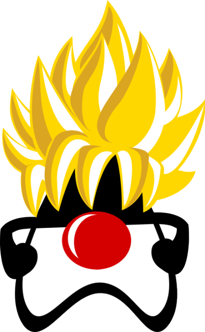
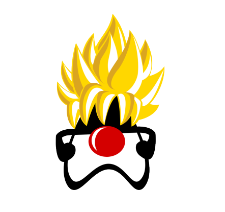
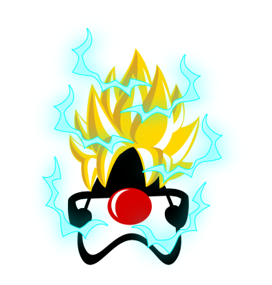
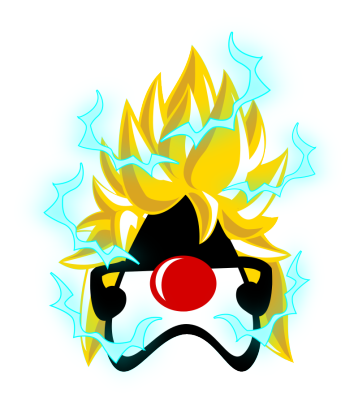
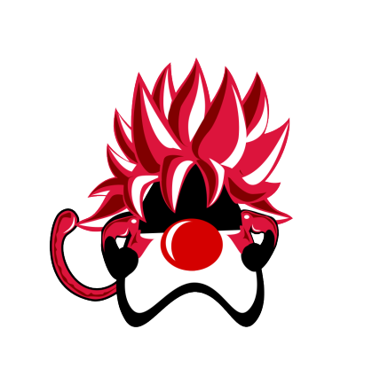
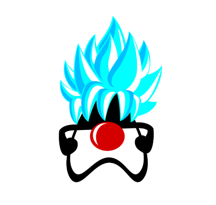
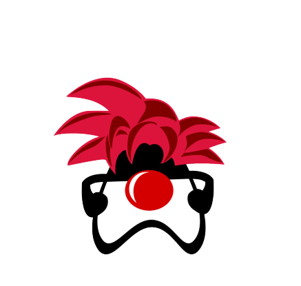

# Duke Super Saiyajin

This project is a playful satire combining Java's mascot, Duke, with the iconic Super Saiyajin transformation from Dragon Ball Z. The artwork humorously depicts Duke as a Super Saiyajin, showcasing the fusion of two beloved pop culture elements: programming and anime.

## Levels of Super Saiyajin

Here are the different levels of Super Saiyajin represented:

### Super Saiyajin 1

### Super Saiyajin 2

### Super Saiyajin 3

### Super Saiyajin 4

### Super Saiyajin Blue

### Super Saiyajin God

## License

This project is licensed under the MIT License. Feel free to use, modify, and distribute the image as long as you provide appropriate credit.

## Contribute

You can contribute to this project in several ways:

- Help correct and improve this `README.md`.
- Discuss and suggest an appropriate license for the project.
- Create new images related to the theme of Java/Dragon Ball.
- Share your ideas and suggestions for enhancing the project.

## Created by

The project and concept were envisioned by [samuelsonbrito](https://github.com/samuelsonbrito), and the artwork was created by [JABAGAMEHUNTER](https://github.com/JABAGAMEHUNTER).